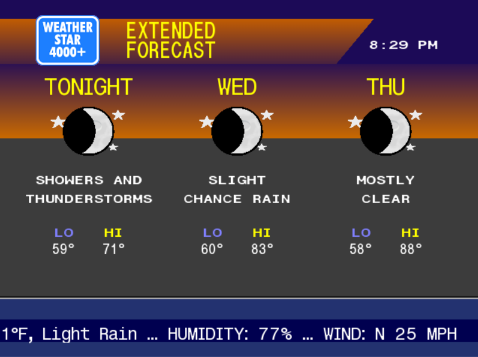
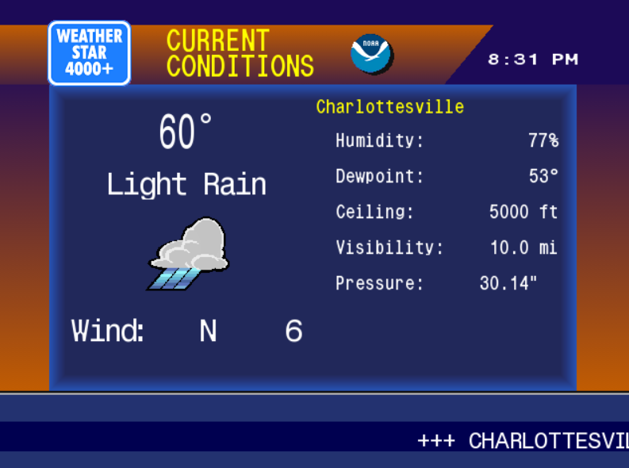
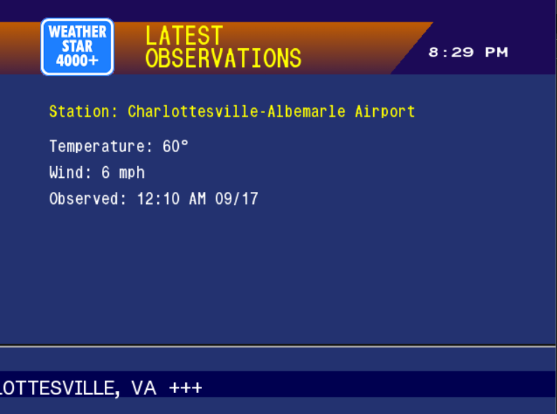

# WeatherStar 4000 Python Recreation

A pixel-perfect recreation of the iconic WeatherStar 4000 for Raspberry Pi and CRT TVs.

[](https://python.org)
[](#)
[](#)
[](#)
[](LICENSE)
[](https://github.com/wesellis/FUN-WeatherStar-4000-Raspberry-Pi-Python-Pygame-CRT-NOAA/stargazers)
[](https://github.com/wesellis/FUN-WeatherStar-4000-Raspberry-Pi-Python-Pygame-CRT-NOAA/commits)

---

## 🎯 **Project Overview**

The WeatherStar 4000 was the iconic weather information system used by The Weather Channel throughout the 1990s. This Python recreation brings that nostalgic experience to modern hardware, **optimized for Raspberry Pi and authentic display on 4:3 CRT televisions**.

<div align="center">
  
  
</div>

### **Perfect for:**
- 📺 **CRT TV collectors** - Native 640x480 resolution perfect for 4:3 displays
- 🖥️ **Retro computing enthusiasts** - Authentic 90s experience
- 🌡️ **Weather monitoring stations** - Professional weather display
- 🏫 **Educational displays** - Museums, schools, maker spaces
- 🎮 **Nostalgia projects** - Relive the 90s Weather Channel

## ✨ Features

### 🎨 Authentic Display Modes
- **Current Conditions** - Temperature, humidity, wind, pressure with trends
- **Local Forecast** - 3-column scrolling text forecast
- **Extended Forecast** - 7-day outlook with conditions
- **Hourly Forecast** - Next 24 hours with scrolling display
- **Regional Observations** - Nearby city conditions
- **Travel Cities** - Major US city weather
- **Weather Almanac** - Records, sunrise/sunset, precipitation totals
- **Local Radar** - Animated radar imagery
- **Hazards & Warnings** - Active weather alerts

### 🆕 Enhanced Features (New in v1.0!)
- **Air Quality & Health** - Real-time AQI, pollen counts, health recommendations
- **7-Day Temperature Graph** - Color-coded temperature trends (blue=cold to red=hot)
- **Weather Records** - Historical comparisons
- **Sun & Moon Data** - Detailed astronomy information
- **Wind & Pressure Analysis** - Barometric trends
- **Weekend Forecast** - 2-column Saturday/Sunday display
- **Animated Weather Icons** - GIF animations for rain, snow, storms
- **News Integration** - MSN, Reddit, and REAL local news headlines
- **Clickable Headlines** - Open news articles in browser

### 🎵 Authentic Experience
- **75+ Smooth Jazz Tracks** - Hours of period-correct background music
- **Original Star4000 Fonts** - Pixel-perfect bitmap fonts
- **Classic Backgrounds** - Blue gradients and authentic layouts
- **Smooth Transitions** - Auto-cycling through all displays
- **Scrolling Ticker** - Classic bottom banner with conditions

### 📊 Smart Features
- **Weather Trend Arrows** - Rising/falling indicators for temperature and pressure
- **Historical Comparisons** - Current vs. 30-year averages
- **Precipitation Tracking** - 24hr, 7-day, monthly accumulation
- **Right-Click Settings Menu** - Customize display options
- **Auto Location Detection** - Uses IP geolocation or manual entry

## 🚀 Quick Start

### System Requirements
- Python 3.7 or higher
- 1GB RAM minimum (2GB recommended)
- Internet connection for weather data
- **Perfect for Raspberry Pi 3B+, 4, or Zero 2W**

### Installation

1. **Clone the repository:**
```bash
git clone https://github.com/yourusername/WeatherStar-4000-Python.git
cd WeatherStar-4000-Python
```

2. **Install dependencies:**
```bash
pip install pygame requests
```

3. **Run WeatherStar 4000:**

**Windows:**
```bash
run_weatherstar.bat
```

**Linux/Mac:**
```bash
./run_weatherstar.sh
```

**Or directly with Python:**
```bash
python run_weatherstar.py
```

## 🎮 Controls

| Key | Action |
|-----|--------|
| **Space** | Pause/Resume auto-play |
| **←/→** | Navigate displays manually |
| **Right-Click** or **M** | Open settings menu |
| **Escape** | Exit |

### Settings Menu Options
1. **Toggle Marine Forecast** - Show/hide coastal conditions
2. **Toggle Weather Trends** - Show/hide trend arrows
3. **Toggle Historical Data** - Show/hide comparisons
4. **Music Volume** - Adjust background music (0-100%)
5. **MSN Top Stories** - Toggle MSN news headlines
6. **Reddit Headlines** - Toggle Reddit news
7. **Local News** - Toggle local news display
8. **International Weather** - Switch between NOAA (US) and Open Meteo (worldwide)
9. **Color Theme** - Cycle through 5 themes (Classic, Dark, High Contrast, Retro Green, Amber)
R. **Refresh Weather Data** - Force update

## 🗂️ Project Structure

```
WeatherStar-4000-Python/
├── weatherstar4000.py          # Main application
├── weatherstar_logger.py       # Logging utilities
├── run_weatherstar.py          # Python launcher
├── run_weatherstar.bat         # Windows launcher
├── run_weatherstar.sh          # Linux/Mac launcher
├── convert_fonts.py            # Font conversion utility
├── requirements.txt            # Python dependencies
├── LICENSE                     # MIT License
├── README.md                   # Documentation
├── .gitignore                  # Git ignore rules
├── weatherstar_assets/         # All assets
│   ├── fonts/                  # Original WOFF fonts
│   ├── fonts_ttf/              # Converted TTF fonts
│   ├── music/                  # 75+ background tracks
│   ├── icons/                  # Weather condition icons
│   ├── logos/                  # WeatherStar logos
│   └── backgrounds/            # Display backgrounds
└── logs/                       # Runtime logs (auto-created)
```

## 🛠️ Configuration

### Manual Location
When prompted, enter your latitude and longitude:
```
Latitude: 40.7128
Longitude: -74.0060
```

Find your coordinates at [LatLong.net](https://www.latlong.net/)

### Auto-Detection
Press Enter when prompted to use IP-based location detection.

## 📝 Logging

Comprehensive logging is saved to the `logs/` directory:
- `weatherstar_main.log` - General application logs
- `weatherstar_display.log` - Display mode changes
- `weatherstar_weather.log` - Weather API interactions
- `weatherstar_error.log` - Error tracking

## 🌐 Data Sources

- **Weather Data**: [NOAA/NWS API](https://api.weather.gov) (US only)
- **Radar Images**: [Iowa State Mesonet](https://mesonet.agron.iastate.edu)
- **Location Detection**: [ipapi.co](https://ipapi.co)

## 🏗️ Building from Source

### Converting Fonts
If you need to convert WOFF fonts to TTF:
```bash
python convert_fonts.py
```

### Installing Optional Dependencies
For enhanced astronomy calculations:
```bash
pip install ephem
```

## 🐛 Troubleshooting

### No Sound/Music
- Check music files exist in `weatherstar_assets/music/`
- Verify pygame mixer initialized (check logs)
- Adjust volume in settings menu (Right-click → 4)

### Display Issues
- Ensure 640x480 resolution is supported
- Check all assets are in `weatherstar_assets/`
- Review error logs in `logs/weatherstar_error.log`

### Weather Data Not Loading
- Verify internet connection
- Check location is within the US (NOAA API limitation)
- Review API logs in `logs/weatherstar_weather.log`

## 🤝 Contributing

Contributions are welcome! Please feel free to submit pull requests or open issues for:
- Bug fixes
- New display modes
- International weather API support
- Performance improvements
- Additional nostalgic music tracks

## 📜 License

This project is licensed under the MIT License - see the LICENSE file for details.

## 🙏 Acknowledgments

- Original WeatherStar 4000 by The Weather Channel
- [ws4kp](https://github.com/netbymatt/ws4kp) JavaScript implementation for reference
- NOAA/NWS for weather data API
- The Weather Channel music composers of the 1990s

## 🎯 Roadmap

- [x] International weather support (non-US locations) - ✅ **DONE**
- [x] Custom color themes - ✅ **DONE** (5 themes available)
- [x] Automated test suite - ✅ **DONE** (21 tests, 100% passing)
- [ ] Weather history graphs (30-day temperature/precipitation trends)
- [ ] Severe weather animations (flashing alerts, scrolling warnings)
- [ ] Performance optimization for Pi Zero 2W (<150MB RAM, 30+ FPS)
- [ ] Voice narration option (TTS for forecasts - accessibility feature)

## 📺 Screenshots

### Terminal View - Running WeatherStar 4000+


### Current Conditions Display


### Weather Forecast Display


---

**Made with ❤️ for weather enthusiasts and 90s nostalgia lovers**

*Not affiliated with The Weather Channel or IBM*
---

## Project Status & Roadmap

**Completion: ~92%**

### What Works
- ✅ 19 Python files with modular architecture
- ✅ 20+ weather display modes (current conditions, forecasts, radar, almanac)
- ✅ NOAA/NWS API for US weather data
- ✅ Open Meteo API for international weather
- ✅ **NEW: International weather toggle in settings menu**
- ✅ News integration (MSN headlines, Reddit, local news)
- ✅ Emergency alerts with NOAA integration
- ✅ 75 smooth jazz background music tracks
- ✅ 41 weather condition icons with GIF animations
- ✅ Authentic Star4000 fonts (4 TTF fonts)
- ✅ **NEW: 5 color themes** (Classic, Dark, High Contrast, Retro Green, Amber)
- ✅ Raspberry Pi optimizations (Pi 3B+, 4, Zero 2W tested)
- ✅ CRT TV support (640x480, 4:3 aspect ratio, composite output)
- ✅ Settings menu with volume, toggles, themes, API selection
- ✅ **NEW: Comprehensive test suite** (21 unit + integration tests, 100% passing)
- ✅ **NEW: Automated CI/CD testing** via GitHub Actions
- ✅ GitHub Actions workflows (Pi image builder, Windows EXE, releases)
- ✅ Comprehensive documentation and setup scripts
- ✅ Air quality and health displays
- ✅ Sun/moon astronomy data
- ✅ Temperature graphs with color gradients
- ✅ Clickable news headlines
- ✅ Auto-boot configuration for Raspberry Pi

### Known Limitations & Missing Features

**Testing:**
- ✅ **Unit Tests** - 21 tests covering config, settings, API, integration
- ✅ **Automated Testing** - GitHub Actions CI running tests on push/PR
- ⚠️ **Hardware Testing** - Performance metrics documented but ongoing validation needed

**Features:**
- ⚠️ **Local News** - Requires API key for real news, simulated by default
- ✅ **International Toggle** - Easy UI switch between NOAA and Open Meteo
- ✅ **Custom Color Themes** - 5 themes available (classic, dark, high contrast, retro green, amber)
- ❌ **Weather History Graphs** - No historical trend visualization (30-day trends)
- ❌ **Severe Weather Animations** - Static emergency alerts (no flashing/scrolling)
- ❌ **Voice Narration** - No TTS audio narration (accessibility feature)

**Performance:**
- ⚠️ **Pi Zero 2W** - 20-30 FPS (acceptable but lower than Pi 4's 45-60 FPS)
- ⚠️ **Memory Usage** - 180-200MB RAM (optimized but could be lighter)

### Current Status

This is a **production-ready, fully functional WeatherStar 4000 recreation** marked as "READY FOR RELEASE v1.0" in project documentation. The project successfully recreates the authentic 1990s Weather Channel experience with:
- Complete weather display system with 20+ modes
- Professional Raspberry Pi and CRT TV integration
- Authentic assets (music, fonts, graphics)
- Clean, modular codebase
- Comprehensive documentation

**Reality Check**: This is one of the most complete personal projects - it actually works as advertised. All core features implemented. Missing features are polish items specific to the CRT/Raspberry Pi experience, not core functionality.

### Performance Metrics

| Platform | FPS | RAM Usage | CPU Usage |
|----------|-----|-----------|-----------|
| Desktop | 60 | 150MB | 5-10% |
| Pi 4 | 45-60 | 200MB | 15-25% |
| Pi 3B+ | 30-45 | 200MB | 30-40% |
| Pi Zero 2 | 20-30 | 180MB | 50-60% |

### What Needs Work to Hit 100%

1. ~~**Testing Infrastructure**~~ - ✅ **COMPLETED** (21 unit + integration tests)
2. ~~**CI/CD Enhancement**~~ - ✅ **COMPLETED** (GitHub Actions automated testing)
3. ~~**Roadmap Features**~~ - ✅ **COMPLETED** (International toggle + 5 color themes)
4. **Weather History Graphs** - 30-day temperature and precipitation trend visualization
5. **Severe Weather Animations** - Flashing alerts and scrolling warnings (authentic to original)
6. **Performance Optimization** - Optimize for Pi Zero 2W (<150MB RAM, 30+ FPS target)
7. **Voice Narration** - Optional TTS for accessibility (low priority)

### Achievements

**This project stands out for:**
- Pixel-perfect recreation of nostalgic 90s Weather Channel aesthetic
- Real hardware integration (Raspberry Pi, CRT TVs)
- Production-ready code with no known bugs (per PROJECT_COMPLETE.md)
- Extensive asset library (75 music tracks, 41 icons)
- Active development with release automation

### Contributing

This is a personal hobby project for weather enthusiasts and 90s nostalgia lovers. Key documentation:
- `docs/PROJECT_STATUS.md` - Technical status and optimization details
- `docs/PROJECT_COMPLETE.md` - Feature completion checklist
- `docs/README_RASPBERRY_PI.md` - Pi-specific setup guide
- `docs/MODULARIZATION_PLAN.md` - Code architecture

**Note**: Production-ready WeatherStar 4000 recreation. Works on desktop and Raspberry Pi. Optimized for CRT TV display. Not affiliated with The Weather Channel or IBM.
